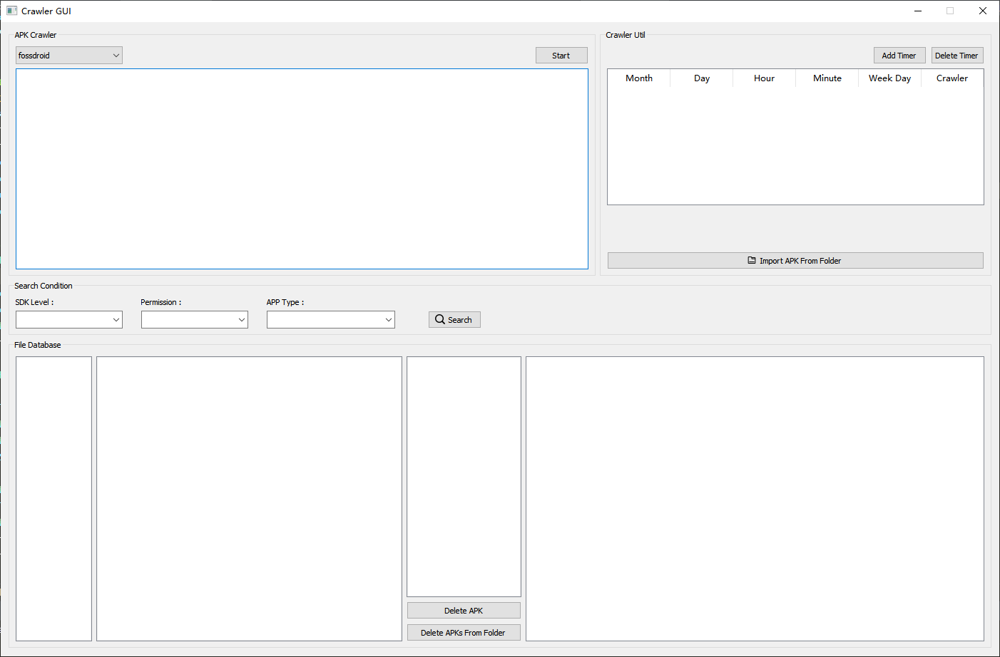

# Crawler for APP Platform

项目中抽离出来的 apk 爬虫模块，支持 [ApkPure](https://apkpure.com/) , [Github](https://github.com/search?q=apk&type=commits) , [Xiaomi](https://app.mi.com/) , [FossDroid](https://fossdroid.com/) .

整个爬虫采用 Scrapy + Mysql 对目标平台上的apk增量进行爬取，大家对这些平台按需爬取，不要影响这些平台的正常运作 :blush: .

## 目录结构

- `codes` 目录下为主要的代码
- `documents` 目录下存储必要的sql文件和其他必要的说明文件
- `data` 目录下存储爬取后的apk文件
- `log` 目录下存储爬取过程中的log日志
- `pictures` 目录下存储图片

## 拷贝项目

1. 拷贝项目: 

        $ cd workspace/
        $ git clone https://github.com/RiskySignal/APKCrawler
        $ cd crawl_for_apk_merge/

## 数据库Mysql配置

1. 安装Mysql: 详细可参照 [这里](https://wangxin1248.github.io/linux/2018/07/ubuntu18.04-install-mysqlserver.html), 仅需完成 **安装 Mysql** 和 **配置 Mysql** .
2. 确认在 **当前** 用户下可以通过命令 `mysql -u root -p` 登录mysql, 程序中默认的密码为 `123456` .
3. 初始化数据库: 
   
    其中复制 my.cnf 这一步不是必须的，你可以自己配置自己的mysql中的字符集为 `utf-8`.

        $ cd crawl_for_apk_merge/
        $ sudo cp ./documents/my.cnf /etc/mysql/my.cnf
        $ sudo service mysql restart
        $ mysql -u root -p
        
        mysql> create database apk_merge;
        mysql> source ~/workspace/crawl_for_apk_merge/documents/apk_merge.sql  # 替换项目的路径

## 爬虫搭建

1. 需要的 python 版本为 python3.
2. 进入代码文件夹 `cd ./crawl_for_apk_merge/codes`.
3. 安装依赖包 `pip install -r requirement.txt`.
4. 爬取 apk `python3 main.py --help` 可以查看具体的用法，爬取的过程主要与服务器的下载速度和 Market 的 Apk 数量相关.
5. 直接使用 gui 界面, `python3 main_gui.py` , 在 windows 上不能使用定时器.

## 下载统计及其他脚本

- 下载统计： `python3 statistic.py` 可以查看当前扫描的app数量、apk数量、各类型的数量.
- 筛选apk： `python3 filter_apk.py --help` 可以根据平台和apk大小筛选包.
- 根据apk获取相应信息： `python3 get_apk_info.py --help` 给定apk安装包位置，获取其相应信息.
- 定时任务 timing.sh 设置定时任务
- ~~修复数据库中apk安装包hash值缺失问题： `python3 update_hash.py`  重新计算已有apk的hash并存入数据库 (该hash已经全部入库，正常配置数据库的情况下不再需要该脚本)~~.
- ~~修复数据库自增id空洞问题： `python3 optimize_database.py` 自动修复空洞问题 (该bug已经通过上述的mysql配置解决，正常配置数据库的情况下不再需要该脚本)~~.

## 运行截图

1. github
    

2. xiaomi
    

3. Fossdroid
    

4. ApkPure
    

5. GUI界面
    

## Todo
- ~~写一个简单的QT GUI界面~~ -> 实现了集成 增删查, 定时器, 爬虫在内的界面;
- 扩展爬虫平台
- 将代理的设置加入 GUI 界面
