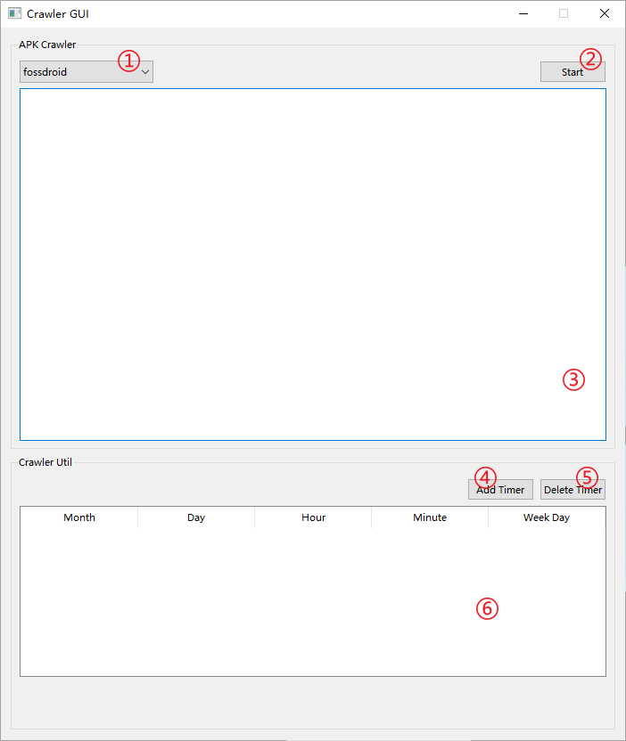

# 使用手册

[TOC]

## 爬虫安装

### `python `安装

- 注意 :warning:：如果 `apt` 下载包比较慢的话，可以考虑修改相应的镜像源，`ubuntu 20.04` 参考博客 https://blog.csdn.net/yscoder/article/details/110681828 进行修改；

- 注意 :warning:：新版本的 `Ubuntu` 中已经自带有 `python3`；

- 安装 `python3` ：具体 `python3` 的版本是 `3.6 ~ 3.8` 均可；

  具体的安装过程不再赘述，详情可以参考博客 https://my.oschina.net/randomobject/blog/4300469 ，**优先**采用方式一 ，不行再采用方式二；

  安装完成后在 `shell` 中测试是否安装成功：（以 `python3.8` 为例）

  ```shell
  python -V
  python3.8 -V #or
  python3 -V #or
  ```

- 常见问题 :warning:：​切记，切记，切记，不要删除 `ubuntu` 自带的 `python`，如果不小心删除，不要重启，立即上网搜索解决办法；

- 修改系统模型 `python3` 指令：

  如何将系统默认的 `python3` 指向 `python3.8`？参考链接 https://blog.csdn.net/maizousidemao/article/details/102810681 ，**优先**采用方法一；

- 常见问题 :warning: ：下面介绍如何使用是直接默认使用 `python` ；


### 数据库安装

- 注意 :warning:：**这里先说一下后面配置的要点**

  - 数据库 `root` 密码：务必记住这个密码，记不住就用 `123456`，这样后面程序里也不需要修改配置；

- 安装 `mysql`：

  具体的安装过程不再赘述，具体参考博客 https://blog.csdn.net/liang19890820/article/details/105071479 ，一直配置到 `配置远程访问` 之前；

  安装完成后在 `shell` 中测试安装是否成功：（**不要**在 `root` 权限下运行下面的指令，以普通用户执行，如果你平常执行代码时就是 `root` 用户，那也可以不用在意）

  ```shell
  $ mysql -u root -p
  Enter password: 123456
  ```

  如果无法登录，那么很可能是你前面配置的时候出了问题；

- 初始化数据库：

  ```shell
  $ mysql -u root -o
  Enter password: 123456
  mysql> show databases;  # 查看数据库
  mysql> create database apk_merge;  # 创建apk_merge数据库
  mysql> show databases;  # 查看数据库
  # 自行替换路径
  mysql> source /home/<user>/<project_path>/documents/apk_merge.sql  # 创建数据库表和存储过程，后面的路径修改成你本地的apk_merge.sql文件
  ```


### 依赖包安装

- 进入目录：（手册中的路径名为测试时的路径名称，实际配置过程中请与实际的爬虫路径相匹配）

  ```shell
  cd ~/workspace/APKCrawler/codes
  ```

- 注意:warning: ：为了不影响 `python` 的正常工作，你可以创建一个 `python` 的虚拟环境，具体的操作流程参考博客 https://zhuanlan.zhihu.com/p/60647332 ，两种方法都非常实用，看个人喜好；

- 注意:warning: ：`pip` 默认用的是国外的镜像源，国内访问可能网速很慢，可以设置一个国内的镜像源，具体的操作流程参考博客 https://zhuanlan.zhihu.com/p/109939711 ；

- 安装 `python` 依赖包：

  ```shell
  pip install -r requirement.txt
  ```

- 安装 `crontab` 依赖包：

  具体操作参考博客 https://blog.csdn.net/longgeaisisi/article/details/90477975 .

- `pyqt5` 依赖包安装：

  执行下面的脚本时，可能会出现如下错误：

  ```shell
  qt.qpa.plugin: Could not load the Qt platform plugin "xcb" in "" even though it was found.
  This application failed to start because no Qt platform plugin could be initialized. Reinstalling the application may fix this problem.
  
  Available platform plugins are: eglfs, linuxfb, minimal, minimalegl, offscreen, vnc, wayland-egl, wayland, wayland-xcomposite-egl, wayland-xcomposite-glx, webgl, xcb.
  
  Aborted (core dumped)
  ```

  为了解决这个问题，执行指令：

  ```shell
  sudo apt-get install libxcb-xinerama0
  ```

  如果安装了该辅助包后，`pyqt5` 仍无法正常运行，则参考博客 https://blog.csdn.net/zhanghm1995/article/details/106474505 来具体查看缺少的依赖包；


## 爬虫使用

### 远程桌面

为了能够在局域网（服务器不联网的情况下），远程桌面连接到服务器，针对 `ubuntu 20.04` 可以参考博客 https://zhuanlan.zhihu.com/p/345738274 对服务器进行配置，配置完成后，可以通过 `windows` 自带的远程桌面连接到服务器；


### 更改文件路径

#### 方法一

由于多数情况下爬虫需要和 **安装包分析脚本** 搭配使用，所以需要保证两个脚本之间的文件保存路径一致，故这里给出一种更加直接的修改方式：`文件软链接`

#### 方法二


### 参数配置

> 使用爬虫前，还有一些不得不做的配置

- 爬虫并发数：默认为 `16` ，配置位置 `settings.py` 文件 `CONCURRENT_REQUESTS` 参数；
- 下载延迟时间：默认为 `3` 秒，配置位置 `settings.py` 文件 `DOWNLOAD_DELAY` 参数；
- 下载保存位置：默认为 `data` 文件夹（没有特殊情况，无需修改），配置位置 `settings.py` 文件 `FILES_STORE` 和 `IMAGES_STORE` 参数；
- 爬虫日志：默认开启 `DEBUG` 级别的日志，同时在命令行中输出，配置位置 `settings.py` 文件 `LOG_ENABLED` 、 `LOG_LEVEL` 和 `LOG_STDOUT` 参数；
- 数据库设置：默认为 `root@localhost` 的 `apk_merge` 库，端口为 `3306`，用户名为 `root` ，密码为 `123456` ，配置位置 `settings.py` 文件 `DB_*` 参数；
- 代理配置：默认**不**启用 `http://127.0.0.1:10809` 的代理（:warning: 是否启动代理还可以在启动爬虫的时候进行配置，这个代理需要你额外已经配置了第三方的代理服务），配置位置 `settings.py` 文件 `USING_PROXY` 和 `PROXY_PATH` 参数；
- `Python` 接口：默认为 `python` （:warning: 这里需要保证和你命令行里使用的 `python` 指令相同，如果你用了虚拟环境，这个就不用修改；如果你用的是 `跑python3` ，那么这里修改为 `python3`，以此类推），配置位置 `settings.py` 文件 `python_interface` 参数；
- 开源代码爬虫关键字：默认为 `["apk", 'android']`（爬虫 `github_opensource` 以这些关键字在网页上检索），配置位置 `settings.py` 文件 `crawler_key_words` 参数；


### 爬虫 Crawler GUI

#### 命令行启动

服务器中，我们通常会在桌面创建一个 `桌面快捷启动程序`，如果你要在命令行启动相应的 `GUI` 界面，你可以在**工程目录下**运行如下指令：

```shell
python crawler_gui.py
```

启动后的界面如下所示：这里将根据标号的顺序进行说明（<font color=grey><u>文档版本可能会落后于实际的爬虫脚本版本，但整体上的功能都是相似的</u></font>）



#### 爬虫

- 启动：在 ① 中，选择目标爬虫，点击按钮 ② `Start` 即可启动爬虫，且按钮 ② 将转换成 `Stop` 按钮，下图展示启动后的界面截图；


- 停止：若要停止，点击按钮 ②  `Stop` 即可关闭爬虫；
- 日志：默认情况下，爬虫的日志文件均在 `./log` 文件夹下，并且在运行时会展示在日志框 ③ 中；
- 注意 :warning:：如果你执行完 **‘启动’** 步骤后，日志框 ③ 中没有任何打印信息，说明爬虫没有被正常启动，最大的可能是 “参数配置”——“`Python` 接口” 没有正确配置；

#### 定时任务

> 由于定时任务需要依赖于 `Linux` 平台的 Cron 包，所以在 `Windows` 上该功能不能使用，同时，该文档希望你在设置定时人五千，对 `crontab` 有所了解；

- 添加定时任务：点击按钮 ④ `Add Timer` ，输入相应的参数后，即可添加一个定时任务；
- 删除定时任务：选中相应的定时任务后， 点击按钮 ⑤ `Delete Timer` 即可删除相应的定时任务；
- 显示定时任务：已经设置的定时任务会在表格框 ⑥ 中显示；
- 额外操作：可以通过**命令行** `crontab -e` 来编辑定时任务；

#### 桌面启动

桌面启动时非常简单，直接双击桌面图标即可，至于如何制作一个有效的桌面快捷启动方式，参考博客 https://www.jianshu.com/p/c3486d0a91e4；


### 数据 Data GUI

#### 命令行启动

在工程文件夹下执行如下命令：

```shell
python data_gui.py
```

启动后的界面如下所示：


#### 搜索

- 在 ① 中选择筛选的条件，点击 `Search` ② 按钮后，即可查询相应的 APK 文件，显示在 ④ 中；
- 在 ⑥ 中你还可以将一个 APK 文件直接拖到 **信息栏**（最右侧矩形框）中查看相应的 APK 详情；
- 下面展示一组检索后的结果：


#### 导入本地的 APK

- 点击 ③ 中的按钮，选择相应的文件夹，即可导入本地的 APK；


#### 删除 APK

- 单个删除：点击 ⑤ 中的 `Delete APK` 即可删除 **信息栏**（最右侧矩形框） 中的 APK；
- 批量删除：点击 ⑤ 中的 `Delete APKs From Folder` 即可将整个文件夹中的 APK 从数据库中删除；


### 增量导出导入

> 首先需要说明的是，这里实现增量导出导入的前提是，数据库 A,B,C 他们的基础 APK 信息都是相同的，即 `app` 等表中的信息是相同的。因此，为保证这个前提，**必须保证**只有一个数据库参与到了爬虫的运行，其他两个库只用于安装包的分析等工作，否则会发生数据库信息错乱；

#### 重置批量导出状态

一般情况下不需要执行该指令，只有当拷贝出现问题的时候，可以将批量导出的状态恢复为前一次的状态；

```shell
python copy_data_incrementally.py ../../data/<pre_status_json_file>  # 将拷贝状态重置为目标文件的状态
```

#### 增量导出

执行脚本如下：

```shell
python copy_data_incrementally.py <target_folder>  # 将文件夹和数据库数据拷贝到目标文件夹
```

#### 增量导入

```shell
python copy_data_incrementally.py <target_folder>  # 将文件夹和数据库数据从目标文件夹拷贝到data文件夹中
```

